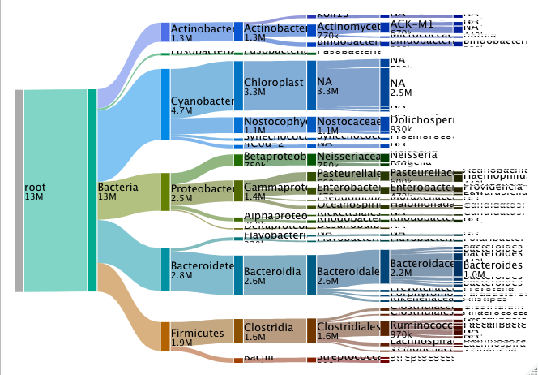

# phyloseq_sankey
A function that makes it super-duper easy to make interactive Sankey plots from phyloseq objects. Based on the hiervis package which is based on d3-hierarchy and d3-hiervis.

These plots are admittedly pretty ugly, but I've found them to be useful for data exploration. Please feel to contribute / improve! It'd eventually be great to map colors onto these a la [metacoder](https://grunwaldlab.github.io/metacoder_documentation/). This may be easy to do, but I'm not very familiar with d3.

### For a demonstration, check out the github pages website: https://ianartmor.github.io/phyloseq_sankey/

